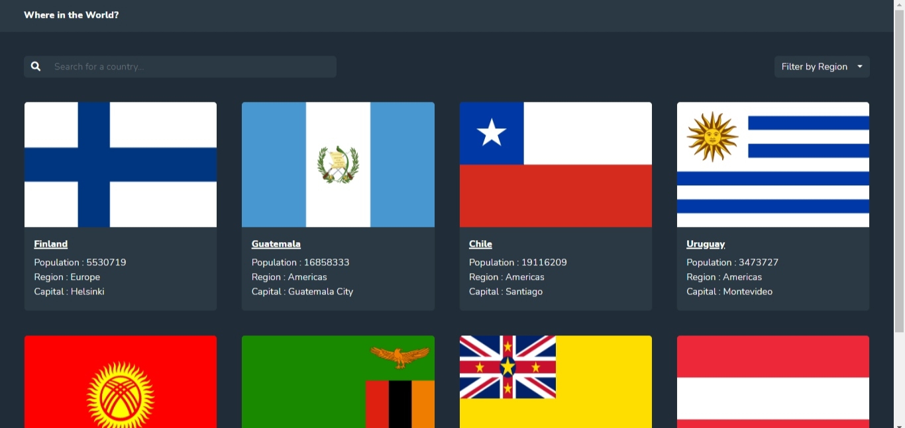
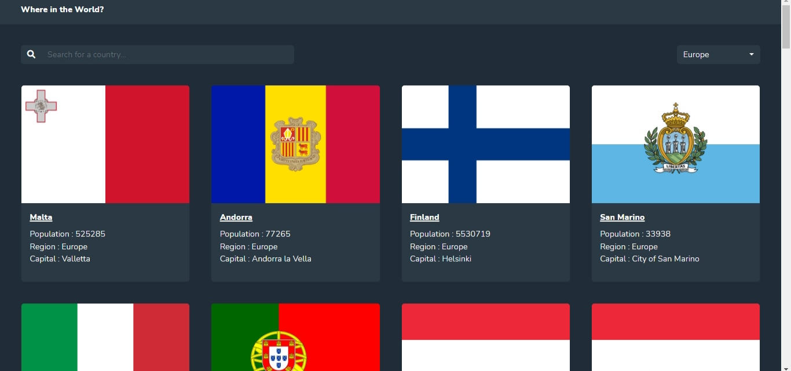
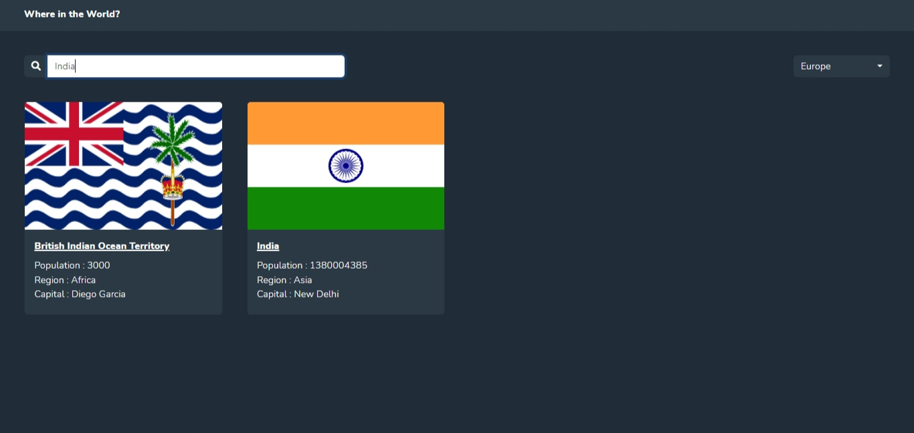
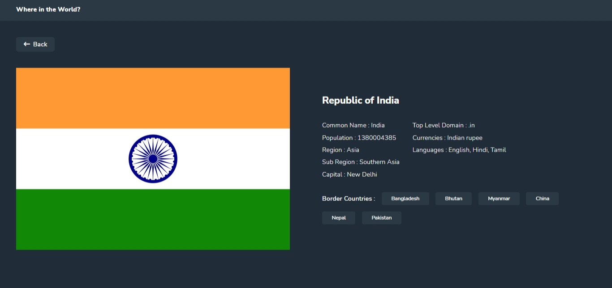

# rest-countries_api

This is a solution to the [REST Countries API with color theme switcher challenge on Frontend Mentor](https://www.frontendmentor.io/challenges/rest-countries-api-with-color-theme-switcher-5cacc469fec04111f7b848ca). Frontend Mentor challenges help you improve your coding skills by building realistic projects. 

## Table of contents

- [Overview](#overview)
  - [The challenge](#the-challenge)
  - [Screenshot](#screenshot)
  - [Links](#links)
- [My process](#my-process)
  - [Built with](#built-with)
  - [What I learned](#what-i-learned)
  - [Continued development](#continued-development)
  - [Useful resources](#useful-resources)
- [Author](#author)

## Overview

### The challenge

Users should be able to:

- See all countries from the API on the homepage
- Search for a country using an `input` field
- Filter countries by region
- Click on a country to see more detailed information on a separate page
- Click through to the border countries on the detail page
- Toggle the color scheme between light and dark mode *(optional)*

### Screenshot

### Links

- Solution URL: [https://github.com/tushar885/rest-countries-api_app](https://github.com/tushar885/rest-countries-api_app)
- Live Site URL: [https://tushar885.github.io/rest-countries-api_app/](https://tushar885.github.io/rest-countries-api_app/)

## My process

### Built with

- Semantic HTML5 markup
- CSS custom properties
- Flexbox
- CSS Grid
- Bootstrap
- Laptop-first workflow
- Vanilla JavaScript**

### What I learned
- How to handle data coming form an API
- Connecting two html pages and sharing data between them through query string
- About window.loaction object 
- Adding Loader to the page

### Continued development

The app is fully responsive but it has no theme switch as of now, will be adding it sometime.

### Useful resources

- [MDN](https://developer.mozilla.org/en-US/) 
- [Stack overflow](https://stackoverflow.com/) 

## Author

- Github - [@tushar885](https://github.com/tushar885)
- Twitter - [@tushars_85](https://twitter.com/tushars_85)

